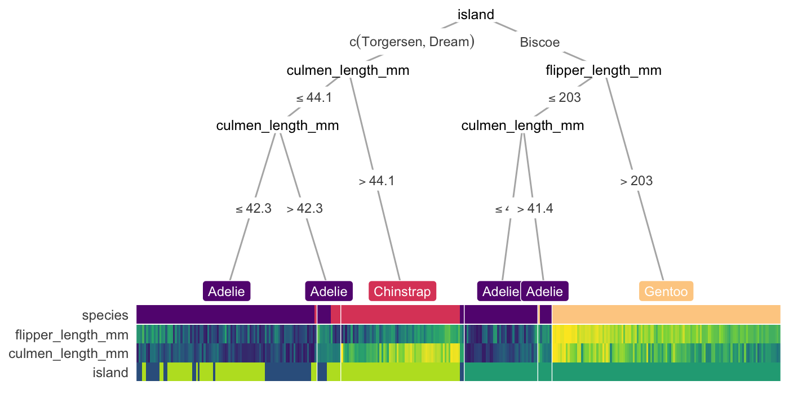
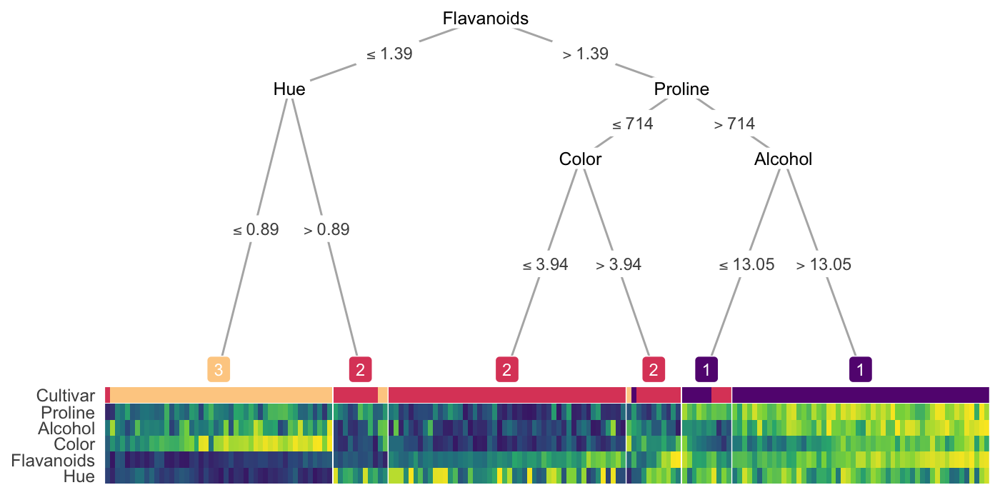

**treeheatr**: an introduction
================

[](https://trang1618.github.io/treeheatr/articles/explore.html)
[](https://trang1618.github.io/treeheatr/reference/)
[](https://github.com/trang1618/treeheatr/actions)
[](https://cran.r-project.org/package=badger)
[](https://doi.org/10.1093/bioinformatics/btaa662)

#### *Your decision tree may be cool, but what if I tell you you can make it hot?*

## Changes in treeheatr 0.2.0

The first argument of `heat_tree()`, `data` is now replaced with `x`,
which can be a dataframe (or tibble), a party (or constparty) object
specifying the precomputed tree, or partynode object specifying the
customized tree. `custom_tree` argument is no longer needed.

## Install

Please make sure your version of R &gt;= 3.5.0 before installation.

You can install the released version of **treeheatr** from CRAN with:

``` r
install.packages('treeheatr')
```

Or the development version from GitHub with remotes:

``` r
# install.packages('remotes') # uncomment to install devtools
remotes::install_github('trang1618/treeheatr')
```

## Examples

### Penguin dataset

Classification of different types of penguin species.

``` r
library(treeheatr)

heat_tree(penguins, target_lab = 'species')
```

<!-- -->

### Wine recognition dataset

Classification of different cultivars of wine.

``` r
heat_tree(wine, target_lab = 'Type', target_lab_disp = 'Cultivar')
```

<!-- -->

## Citing treeheatr

If you use treeheatr in a scientific publication, please consider citing
the following paper:

Le TT, Moore JH. [treeheatr: an R package for interpretable decision
tree visualizations](https://doi.org/10.1093/bioinformatics/btaa662).
*Bioinformatics*. 2020 Jan 1.

BibTeX entry:

``` bibtex
@article{le2020treeheatr,
  title={treeheatr: an R package for interpretable decision tree visualizations},
  author={Le, Trang T and Moore, Jason H},
  journal={Bioinformatics},
  year={2020},
  doi="10.1093/bioinformatics/btaa662"
}
```

## How to Use

**treeheatr** incorporates a heatmap at the terminal node of your
decision tree. The basic building blocks to a **treeheatr** plot are
(yes, you guessed it!) a decision tree and a heatmap.

-   The decision tree is computed with `partykit::ctree()` and plotted
    with the well-documented and flexible
    [**ggparty**](https://cran.r-project.org/package=ggparty/) package.
    The tree parameters can be passed to **ggparty** functions via the
    `heat_tree()` and `draw_tree()` functions of **treeheatr**. More
    details on different **ggparty** *geoms* can be found
    [here](https://github.com/martin-borkovec/ggparty).

-   The heatmap is shown with `ggplot2::geom_tile()`. The user may
    choose to cluster the samples within each leaf node or the features
    across all samples.

Make sure to check out the
[vignette](https://trang1618.github.io/treeheatr/articles/explore.html)
for detailed information on the usage of **treeheatr**.

Please [open an
issue](https://github.com/trang1618/treeheatr/issues/new) for questions
related to **treeheatr** usage, bug reports or general inquiries.

Thank you very much for your support!
